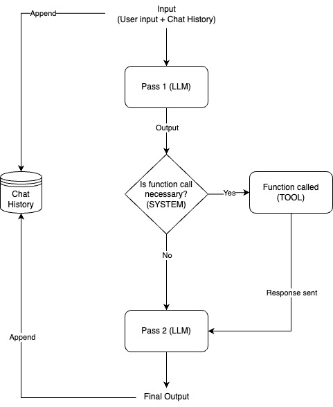

# OceanGPT backend

## What is this?
OceanGPT is a LLM-based application which is used for data analysis. This repository contains the code to the backend of that app (essentially, the brains of the app).
The backend can be run as either a Flask App to integrate with a frontend application or a standalone console application, details of which will be provided in the following sections.

## How does OceanGPT work?
OceanGPT works on a two-stage or multi-pass architecture for LLM interactions.
- The first call to the language model (LLM) is intended to analyze the user input and detect any required function/tool calls. It acts as a “scout” pass to determine if external actions (e.g., executing a tool) are necessary.
- The second call processes the results of these tool executions, integrating responses back into the conversation for a refined, contextually aware response.

For the purposes of this project, I have fine tuned the 3B parameter version of llama3.2 - `function_tuned` so that it can handle function calls more efficiently.

For more information on fine tuning LLMs, visit [Unsloth](https://unsloth.ai/), which was used to fine tune llama3.2-3B in this project.

## What can OceanGPT do?
OceanGPT has a wide range of capabilities : Ranging from general chat to data analysis using predefined functions, or entirely generating it's own code.

Some of it's functions are listed below:
1. Fetch sea level data from the NOAA database.
2. Perform analysis on the datasets such as, plotting sea level trends over the years and table manipulation.
3. Running self-generated code during runtime to keep up with user demands.

## Architecture Diagram
